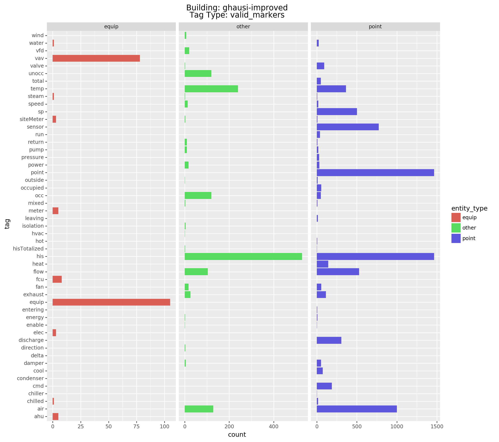

# building_graphs
Building of Haystack / Brick Graphs

# Introduction
The purpose of this repo is to provide examples and utility functions for working with Brick / Haystack data.  Haystack is used predominantly in industry, but the Haystack 4.0 standard is currently being developed to provide additional structure to the Haystack standard.  Previous concerns about the implementation of the Haystack standard across organizations (many of whom define custom tags), as well as recent [HouseOfSticks](https://brickschema.org/papers/HouseOfSticks-BuildSys-2019-Fierro.pdf) paper raises many good questions about Haystack.  The following questions can currently be answered by answered using utility functions in this repo (all questions are wrt the Haystack 4.0 specification):
1. Which markers or vals used in the model are valid / invalid (custom)?
1. For each entity, which markers or vals are valid / invalid (custom)?
1. Is a first class entity type defined for each entity?
1. What is the lowest 'entity subtype' defined for the entity?
1. How many times are different vals / markers used in the model definition, broken out by how they are applied to different first class entity types?

Generally, other questions which intend to be answered:
1. How to understand what is in a Haystack model?
1. Which tags applied are specified in the standard vs. custom?
1. Are defined tags used correctly in combination with other tags to correctly implement typing?
1. How do I know the full set of tags required for a specific type of equipment, point, etc.?

This repository intends to provide methods / open source examples for how to accomplish this.

# Plotting Utilities
## Plots to analyze tags present on entities
`plot1` is designed to create individual plots for each of the tag-categories:
1. invalid_vals: vals present in the model that ARE NOT specified by the Haystack 4.0 defs.ttl
1. invalid_markers: markers present in the model that ARE NOT specified by the Haystack 4.0 defs.ttl
1. valid_vals: vals present in the model that ARE specified by the Haystack 4.0 defs.ttl
1. valid_markers: markers present in the model that AREA specified by the Haystack 4.0 defs.ttl

Investigating valid_vals and valid_markers helps us to see similarites in first class entities with `other` entities, i.e. entities which do not have a first class entity defined.

 


# Setup
1. Clone this repo
1. Create a new virtual environment and install dependencies defined in `requirements.txt`
1. Clone the [brick-examples](https://github.com/BrickSchema/brick-examples) repo to the same directory level as building_graphs:
    ```
    root_dir/
        |-building_graphs
        |-brick-examples
    ```

## examples
Example files showing how to implement and utilize utility functions to achieve a specific purpose.  Comments in the files walk the user through the WHAT and WHY.

## resources
RDF definitions serialized as TTL files for both Brick and Haystack.  Stored locally for convenience.

## scripts
Scripts designed to perform specific functions.
